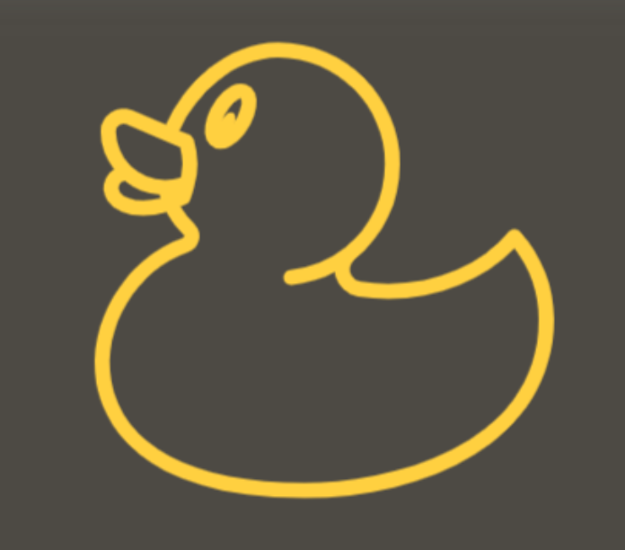

<!-- Improved compatibility of back to top link: See: https://github.com/othneildrew/Best-README-Template/pull/73 -->

<!--
*** Thanks for checking out the Best-README-Template. If you have a suggestion
*** that would make this better, please fork the repo and create a pull request
*** or simply open an issue with the tag "enhancement".
*** Don't forget to give the project a star!
*** Thanks again! Now go create something AMAZING! :D
-->

<!-- PROJECT SHIELDS -->
<!--
*** I'm using markdown "reference style" links for readability.
*** Reference links are enclosed in brackets [ ] instead of parentheses ( ).
*** See the bottom of this document for the declaration of the reference variables
*** for contributors-url, forks-url, etc. This is an optional, concise syntax you may use.
*** https://www.markdownguide.org/basic-syntax/#reference-style-links
-->

<!-- PROJECT LOGO -->
 

    
  </a>

<h3 align="center">Event Horizon</h3>

  

    University of Toronto Events Finder
     
    <a href="https://github.com/ECE444-2023Fall/project-1-web-application-design-group27-rubberducks"><strong>Explore the docs »</strong></a>
     
     
<!--     <a href="https://github.com/ECE444-2023Fall/project-1-web-application-design-group27-rubberducks">View Demo</a> -->
.
    <a href="https://github.com/ECE444-2023Fall/project-1-web-application-design-group27-rubberducks/issues">Report Bug</a>
    ·
    <a href="https://github.com/ECE444-2023Fall/project-1-web-application-design-group27-rubberducks/issues">Request Feature</a>
  

<!-- TABLE OF CONTENTS -->

  
Table of Contents

  <ol>
    <li>
      <a href="#about-the-project">About The Project</a>
      <ul>
        <li><a href="#built-with">Built With</a></li>
        <li><a href="#tools-used">Tools Used</a></li>
      </ul>
    </li>
    <li><a href="#contact">Contact</a></li>
    <li><a href="#acknowledgments">Acknowledgments</a></li>
  </ol>

<!-- ABOUT THE PROJECT -->
## About The Project

The objective of this project is to create a user-friendly webapp as a centralized information center for events around the school. The webapp will serve as a platform for students and faculty to discover and register for events, and for event hosts to manage events, registrants, and obtain analytics relating to the performance of their events. 

(<a href="#readme-top">back to top</a>)

### Built With
* Python
* Flask
* PostgreSQL
* React.js
  

(<a href="#readme-top">back to top</a>)

### Tools Used
* Issue Tracking: [Jira](https://www.atlassian.com/software/jira?&aceid=&adposition=&adgroup=144583515317&campaign=19313277967&creative=660800619493&device=c&keyword=atlassian%20jira&matchtype=e&network=g&placement=&ds_kids=p74602868216&ds_e=GOOGLE&ds_eid=700000001558501&ds_e1=GOOGLE&gclid=Cj0KCQjwhL6pBhDjARIsAGx8D5_eRQpNhggdjEPS138Dn2HqCeNBHTrGL627ZXcQTbnSUMxtXp2pI48aAkE5EALw_wcB&gclsrc=aw.ds)

(<a href="#readme-top">back to top</a>)

<!-- CONTACT -->
## Contact

Tristian (YiFeng) Chen - tristian.chen@mail.utoronto.ca

Rebecca Lashley - rebeccalashleybb@gmail.com

Lily Li - linyi.li@mail.utoronto.ca

Kartikey Sachdeva - kartikeysnotes@gmail.com

Ruoyi Xie - ruoyi.xie@mail.utoronto.ca

Danial Ahmad - danial.ahmad@mail.utoronto.ca

Christian Mcintoch Clarke - christian.mcintoshclarke@mail.utoronto.ca

Project Link: [Event Horizon](https://github.com/ECE444-2023Fall/project-1-web-application-design-group27-rubberducks)

(<a href="#readme-top">back to top</a>)

<!-- ACKNOWLEDGMENTS -->
## Acknowledgments

* contribution.md - sourced from https://gist.github.com/briandk/3d2e8b3ec8daf5a27a62#file-contributing-md
  
* readme.md - sourced from https://github.com/othneildrew/Best-README-Template

(<a href="#readme-top">back to top</a>)

<!-- MARKDOWN LINKS & IMAGES -->
<!-- https://www.markdownguide.org/basic-syntax/#reference-style-links -->
[contributors-shield]: https://img.shields.io/github/contributors/github_username/repo_name.svg?style=for-the-badge
[contributors-url]: https://github.com/ECE444-2023Fall/project-1-web-application-design-group27-rubberducks/graphs/contributors
[forks-shield]: https://img.shields.io/github/forks/github_username/repo_name.svg?style=for-the-badge
[forks-url]: https://github.com/github_username/repo_name/network/members
[stars-shield]: https://img.shields.io/github/stars/github_username/repo_name.svg?style=for-the-badge
[stars-url]: https://github.com/github_username/repo_name/stargazers
[issues-shield]: https://img.shields.io/github/issues/github_username/repo_name.svg?style=for-the-badge
[issues-url]: https://github.com/ECE444-2023Fall/project-1-web-application-design-group27-rubberducks/issues
[license-shield]: https://img.shields.io/github/license/github_username/repo_name.svg?style=for-the-badge
[license-url]: https://github.com/github_username/repo_name/blob/master/LICENSE.txt
[linkedin-shield]: https://img.shields.io/badge/-LinkedIn-black.svg?style=for-the-badge&logo=linkedin&colorB=555
[linkedin-url]: https://linkedin.com/in/linkedin_username
[product-screenshot]: images/screenshot.png
[Next.js]: https://img.shields.io/badge/next.js-000000?style=for-the-badge&logo=nextdotjs&logoColor=white
[Next-url]: https://nextjs.org/
[React.js]: https://img.shields.io/badge/React-20232A?style=for-the-badge&logo=react&logoColor=61DAFB
[React-url]: https://reactjs.org/
[Vue.js]: https://img.shields.io/badge/Vue.js-35495E?style=for-the-badge&logo=vuedotjs&logoColor=4FC08D
[Vue-url]: https://vuejs.org/
[Angular.io]: https://img.shields.io/badge/Angular-DD0031?style=for-the-badge&logo=angular&logoColor=white
[Angular-url]: https://angular.io/
[Svelte.dev]: https://img.shields.io/badge/Svelte-4A4A55?style=for-the-badge&logo=svelte&logoColor=FF3E00
[Svelte-url]: https://svelte.dev/
[Laravel.com]: https://img.shields.io/badge/Laravel-FF2D20?style=for-the-badge&logo=laravel&logoColor=white
[Laravel-url]: https://laravel.com
[Bootstrap.com]: https://img.shields.io/badge/Bootstrap-563D7C?style=for-the-badge&logo=bootstrap&logoColor=white
[Bootstrap-url]: https://getbootstrap.com
[JQuery.com]: https://img.shields.io/badge/jQuery-0769AD?style=for-the-badge&logo=jquery&logoColor=white
[JQuery-url]: https://jquery.com 

